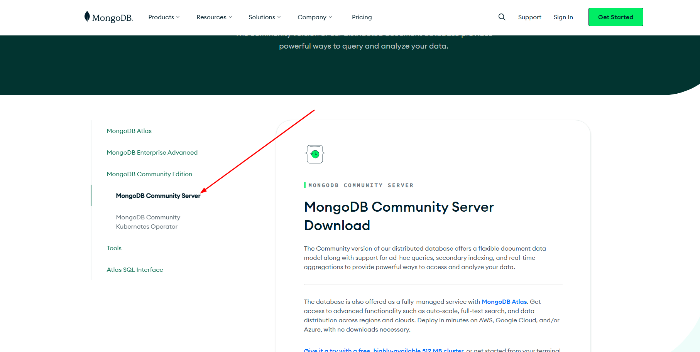
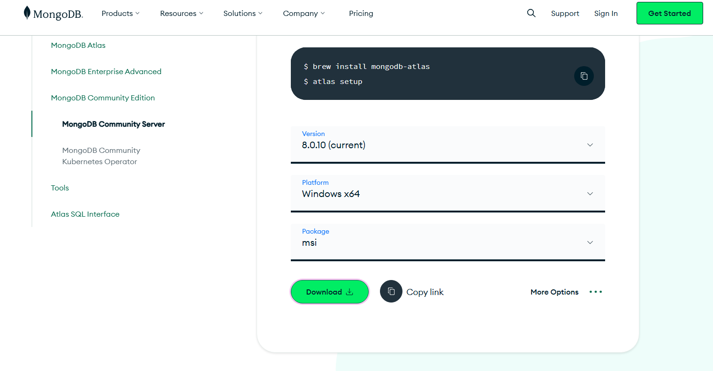

# MongoDB Tutorial

MongoDB is a database.

## Types of Database
1. SQL Databases
2. NoSQL Databases

MongoDB is a NoSQL Databases. It stores all the data in JSON formate.

## How to downlaod MongoDB

Go to link: [MongoDB Download Center](https://www.mongodb.com/try/download/community)

Install MongoDB in your system

## Verify Connection String in Compass:

* Click on **"Add new connection"** in MongoDB Compass.

* Enter the connection string: **mongodb://127.0.0.1:27017/**.

* Click **"Connect"**.